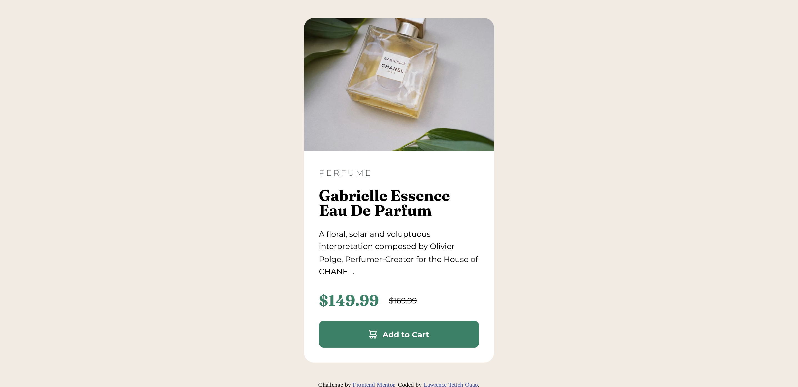

# Frontend Mentor - Product preview card component solution

This is a solution to the [Product preview card component challenge on Frontend Mentor](https://www.frontendmentor.io/challenges/product-preview-card-component-GO7UmttRfa). Frontend Mentor challenges help you improve your coding skills by building realistic projects. 

## Table of contents

- [Overview](#overview)
  - [The challenge](#the-challenge)
  - [Screenshot](#screenshot)
  - [Links](#links)
- [My process](#my-process)
  - [Built with](#built-with)
  - [What I learned](#what-i-learned)
  - [Continued development](#continued-development)
  - [Useful resources](#useful-resources)
- [Author](#author)

## Overview

### The challenge

Users should be able to:

- View the optimal layout depending on their device's screen size
- See hover and focus states for interactive elements

### Screenshot




### Links

- Solution URL: [My solution link](https://github.com/larryQuao/product_preview_card_preview_page)
- Live Site URL: [My live website link](https://product-preview-card-preview-page.vercel.app/)

## My process

### Built with

- Semantic HTML5 markup
- CSS custom properties
- Flexbox
- Mobile-first workflow

### What I learned

I learnt more about responsive designing, using ```@media``` queries, implementing mobile-first designing and alot more
To see how you can add code snippets, see below:


```css
@media (min-width: 1440px) {
  color: papayawhip;
}
```

### Continued development

I would like to continue to implement and learn more about resposive design best practices.

### Useful resources

- [Kevin Powell](https://www.kevinpowell.co/) - Learnt and understood the responsiveness analogy. 
- [W3Schools](https://www.w3schools.com/) - Learnt most of the implementation of responsive design and some best practices as well

## Author

- Frontend Mentor - [@larryQuao](https://www.frontendmentor.io/profile/larryQuao)

